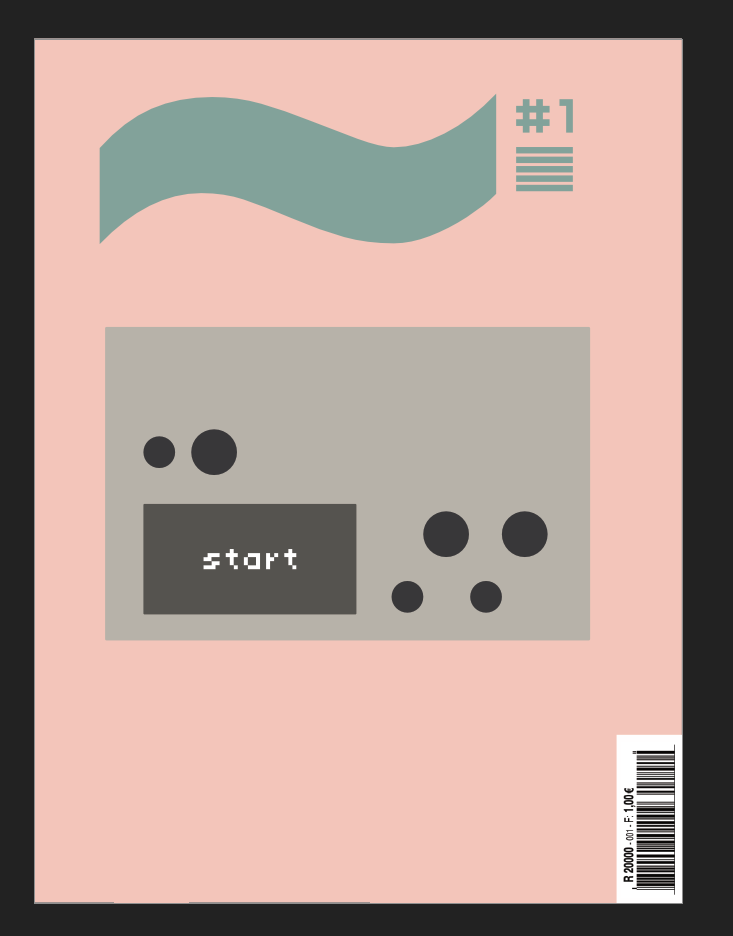
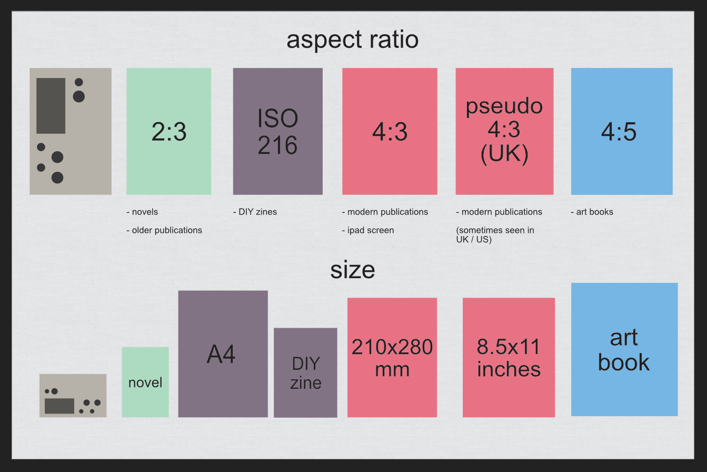
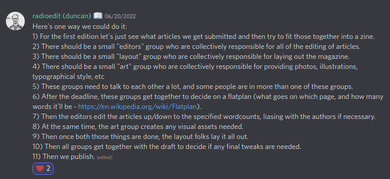
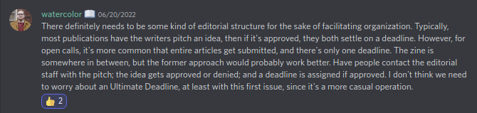

# nornzine #1 - brainstorm #3
20220618

## attendees: @awwaid, @dewb, @eigen (Jordan), @Helen_G, @infinitedigits (Zack), @radioedit (Duncan), @tomw, @zbs (Z)

## agenda topics:

- review of ideas for visual identity (@eigen)
- analysis of available skillset
- process & timing

## ideas for visual identity

#### @eigen - ideas for confronting visuals

using the [kinopio moodboard](https://kinopio.club/zine-visuals-inspo-D9fKE7O6Cb8Bdl0_qGEnw).

key ideas:
- 2 main types of visual inspirations: DIY/punk zine VS pro/modern indie magazine
- possible to merge the 2 by identifying key features of each and applying them

feature selection:
- from DIY we take: muted papery bg colors, degradation & artifacts (xerox effect)
- from modern we take: bold sans serif fonts, contrasting colors, pictures

@eigen's proposed cover art is an example at that

this same recipe could be adapted w/ any different art style, enabling us to collaborate on visuals.

#### @dewb - pen plotter!

paper -> pen plotter.

could be used for backgrounds or even abstract illustrations.

fits the digital meets analog ethos of norns/crow...

#### b&w vs full color

@dewd: b&w is cheaper in case we want medium scale printing (as opposed to print on demand).

cover could still be color.

@eigen: but color allows for more creative freedom, better for photos.

may be hard to coordinate printing ourselves as distribution would be worldwide...

#### use @eigen's draft of a cover

@eigen's draft of a cover deemed cool-enough as definitive cover, unless someone comes up w/ something different/better.

## available skillset

tracked in: [folkpower](https://docs.google.com/spreadsheets/d/1wA6_WsowgkyiLR1f6TThoGs416NLUsQ-qwxcYti3vaw/edit#gid=0)

pretty good repartition between PLAY & MAKE.

best scenario: if everybody that have manifested an interest provides something, would be a pretty decent-sized issue (comparable w/ legitimate publications).

worst scenario: even if we only have half of that, would still end up awesome!

kinda lackluster on the promotion (socials) & logistics (printing) aspects, but those are not super duper critical.

surprising no more photo skills available but that's ok.

## process & timing

#### format

still to be defined, would lean towards the "modern publication".

some may be afraid it might look too big for a "zine".

but how closely do we want to respect the zine tropes?

#### amount of content

@awwaiid: better to have more stuff that needed.

if stuff doesn't fit, just use it for next issue!

@eigen: if we print on demand, we're not tied to a specific nb of paged.

#### timing / deadline(s**

1rst deadline: submitting.

-> **end of july**?

"give us the most finished stuff you can"

fine to send intermediary versions for review before that.

this version will then get proofread / edited. author would get consulted during those.

@eigen: not everybody has a subject yet, might need a 1rst deadline for everyone to choose one.

#### article length

unless recurring feature, no hard fixed length.

-> flexible in how we could fit stuff onto pages.

but still, i'd be nice to define page / word counts goals.

-> need number of words / page.

#### outline document

good enough for tracking.

might need more personal progress / motivation tracking for contributors.

#### process - post-meeting discord though

## final thoughts

#### @awwaid - license declaration

choose & use a license (creative common, copyleft?).

could go alongside the credits.

## next steps

* [ ] @eigen: submit expected nb of words / page.
* [ ] @eigen (Jordan): draft deadline message
* [ ] everyone: proofread this message
* [ ] @eigen: post it on lines
