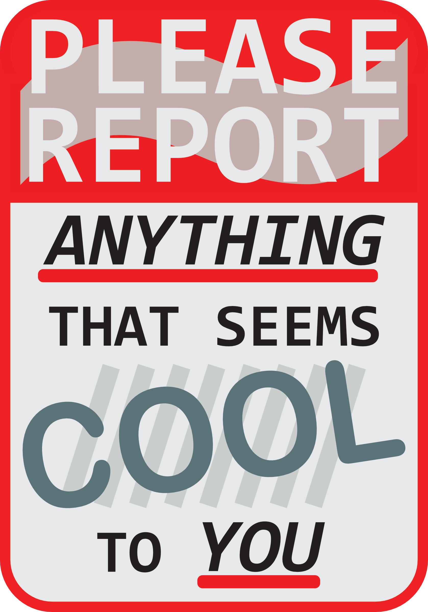
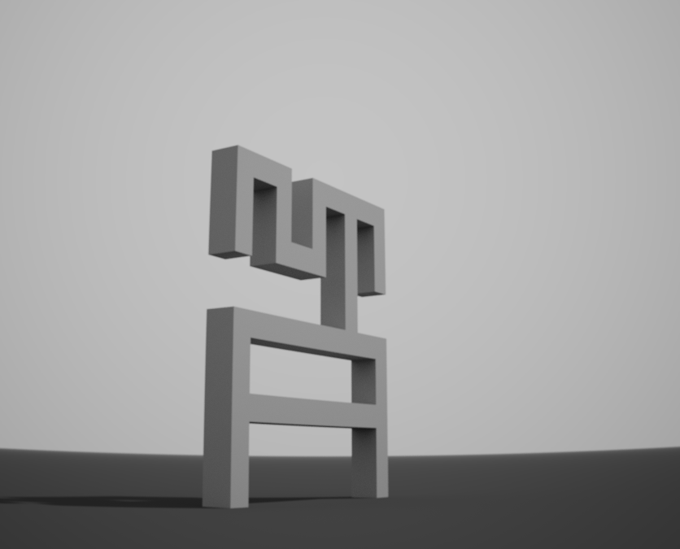

# nornzine #1 - brainstorm #4
20221001

## attendees: @Alanza (Rylee), @radioedit (Duncan), @WilliamHazard (William), @Helen_G (Helen), @renegog (Rene), @eigen (Jordan)

## agenda topics:

- review submissions
- decide next steps

## article submissions so far

10/15 of the proposed articles got submitted.

pretty good ratio given **no real incentive** for anyone to partake in this project.

"sidequest" to your life, won't impact the "main story".

@WilliamHazard noted he nonetheless really appreciated taking the time to write down thoughts on his journey w/ norns/crow & flash crash.

### too few PLAY articles

we mostly have `"MAKE"` articles... imbalance.

we on the discord are nearly all "makers", but are kind of a vocal minority as compared to the whole norns userbase (purely musicians).

so it's important to represent & be interesting to different user profiles.

so we're [still calling for `"PLAY"` articles](https://llllllll.co/t/introducing-norns-zine/55533/15#call-for-contributors-articles-bis-3).

### interviews

interviews are a great source of `"PLAY"` content.

one of us tried to improvise a post-live interview but it didn't go as smoothly as expected (hard thing to do w/ no past experience). (artist is [Dom Cooper](https://www.instagram.com/circle.temple/?igshid=YmMyMTA2M2Y%3D), [live video](https://www.youtube.com/watch?v=pgSq-_mQ64I)).

-> ideally we'd need to prepare a list of generic questions as a basis ("how did you find out about norns?", "what place does it have in your setup?", "ginger ale or tomato juice?"...)

interviews could be made sync or async (through email / DMs).

### compilation of new/cool releases (scripts + music)

asked for people to report cool stuff [in main thread](https://llllllll.co/t/introducing-norns-zine/55533/15#capture-the-excitement-4).

@tomw volounteered to compile those.

### arcologies special

@renegog proposed exploring getting more articles linked to `arcologies`, notably interviews (w/ Tyler + a flash crash performer).

could be cool to have the 2 interviews mirror each other.

would make a nice "arcologies special" subsection.

### generative script rundown

@radioedit is ok to do it all by himself (a light version) in november if we can't reach Ed (who originally proposed).

## next step: editing

focus on **pure editing** (meaning of things, as opposed to **proofreading**, i.e. grammar/spelling).

so be nice when "reviewing" an article but please report if something:
 - seem unclear
 - should be moved around
 - could be rephrased / would benefit having an intro
 - could be cut/developepd more
 - ...

## next step: call for submissions on visuals

### illustrations / photos

should contact people & ask them to pick articles they'd want to illustrate.

first come first served?

for arcologies, idea: represent *structures* as 3d stone ruins.

could use a voxel editor such a [MagicaVoxel](https://ephtracy.github.io/) for getting a basis.

### font setting

selecting fonts & their proportions (+ custom adjustments).

2 people whoe have professional XP in this field have proposed ([@_marimo](https://ruggeri.studio/) + [@petezoid](https://cargocollective.com/peterkazantsev/Logotype)).

@Alanza is also interested by this.

### page layout

now that we start to have some content, start to experiment more seriously w/ content disposition.

## side thoughts

### PLAY vs MAKE

@WilliamHazard: **having the distinction is interesting because it doesn't hold up**.
-> no one was making what i wanted, so i ended making the tool
-> was not the original plan but a very positive outcome

natural blow in this direction.

norns **blurs the lines between user / producer**.

### norns & finishing music

norns can be **intimidating**: not a groovebox, hard to make music fully on it solely (even though some manage such as @McNUG?, @obakegaku...).

often works better in a bigger setup, or just to produce a wacky idea that could help kickstart a song or spice up one that is too tame.

@Helen_G: "do" music (and not make).

it's ok to **practice** and not necessarily commit / release something.
(personal experience VS sharing).

norns as many script that allow this kind of zen, close to a (traditional) "instrument".

speaking of those 2 approaches could help users that may feel a bit lost or even frustrated.

## next steps

* [ ] @eigen: PM people to ask for editing
* [ ] @eigen: PM people to ask for visuals
* [ ] everyone: re-ask on occasion for people to report "cool stuff"
